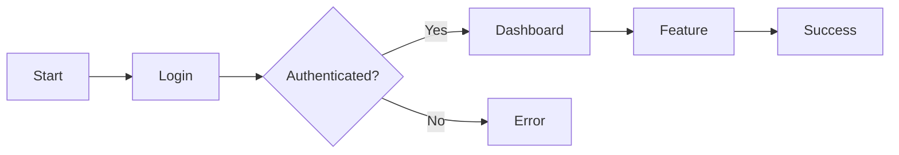

# Product Requirements Document (PRD)

**Document Version:** 1.0
**Last Updated:** [Date]
**Status:** Draft | In Review | Approved
**Author:** [Name]
**Stakeholders:** [List key stakeholders]
**Priority:** [BLOCKER] | [CRITICAL] | [REQUIRED] | [RECOMMENDED] | [OPTIONAL]
**Context Complexity:** XS | S | M | L | XL

---

## Executive Summary

*One paragraph summary of the product/feature, its purpose, and expected impact. Focus on the "why" and "what", not the "when".*

**Quick Facts**:

- **Problem**: [One-line problem statement]
- **Solution**: [One-line solution]
- **Impact**: [Expected outcome]
- **Context Complexity**: [XS/S/M/L/XL - how much understanding needed]

---

## Problem Statement

### The Problem

*What problem are we solving? Why does it exist? Who experiences it?*

**Current Pain Points**:

- Pain point 1: [Specific, measurable]
- Pain point 2: [Specific, measurable]
- Pain point 3: [Specific, measurable]

**Who Experiences This**:

- User group 1: [How often, severity]
- User group 2: [How often, severity]

### Current Solution

*How is this problem currently addressed? What are the limitations?*

**Workarounds**:

- Current approach 1
- Current approach 2

**Limitations**:

- Limitation 1
- Limitation 2

### Opportunity

*What opportunity does solving this problem present?*

**Value Proposition**:

- For users: [Benefit]
- For business: [Impact]
- For team: [Advantage]

---

## Goals and Objectives

### Business Goals

- **Goal 1**: [Specific, measurable business outcome]
- **Goal 2**: [Specific, measurable business outcome]
- **Goal 3**: [Specific, measurable business outcome]

### User Goals

- **Goal 1**: [What users want to achieve]
- **Goal 2**: [What users want to achieve]
- **Goal 3**: [What users want to achieve]

### Success Metrics

| Metric | Current Baseline | Target | Measurement Method |
|--------|-----------------|--------|-------------------|
| Metric 1 | X | Y | How to measure |
| Metric 2 | X | Y | How to measure |
| Metric 3 | X | Y | How to measure |

**Success Criteria**:

- [ ] Metric 1 reaches target
- [ ] Metric 2 reaches target
- [ ] User feedback positive (> 80%)
- [ ] No major issues in production

---

## User Personas

### Primary Persona: [Persona Name]

**Role**: [Job title/role]
**Technical Proficiency**: Low | Medium | High
**Context Familiarity**: New | Intermediate | Expert

**Goals**:

- Goal 1: [What they want to accomplish]
- Goal 2: [What they want to accomplish]
- Goal 3: [What they want to accomplish]

**Pain Points**:

- Pain 1: [Current frustration]
- Pain 2: [Current frustration]
- Pain 3: [Current frustration]

**Behaviors**:

- Behavior 1: [How they currently work]
- Behavior 2: [Preferences and patterns]

**Quote**: *"[Representative quote about their needs]"*

### Secondary Persona: [Persona Name]

*[Repeat structure as needed for additional personas]*

---

## User Stories

### Epic: [Epic Name]

**Epic Context Complexity**: [XS/S/M/L/XL]
**Priority**: [BLOCKER]/[CRITICAL]/[REQUIRED]/[RECOMMENDED]/[OPTIONAL]

#### Story 1: [Story Title]

**As a** [user type]
**I want** [feature/capability]
**So that** [benefit/value]

**Acceptance Criteria**:

- [ ] **GIVEN** [context], **WHEN** [action], **THEN** [outcome]
- [ ] **GIVEN** [context], **WHEN** [action], **THEN** [outcome]
- [ ] **GIVEN** [context], **WHEN** [action], **THEN** [outcome]

**Priority**: P0 (Critical) | P1 (High) | P2 (Medium) | P3 (Low)
**Context Complexity**: XS | S | M | L | XL
**Dependencies**: [Other stories or systems]

**Context Requirements**:

- Understanding needed: [What knowledge is required]
- Integration points: [Systems involved]
- Technical concepts: [New concepts to learn]

#### Story 2: [Story Title]

*[Repeat structure for each story]*

---

## Feature Requirements

### MoSCoW Prioritization

#### Must Have (MVP) - [REQUIRED]/[CRITICAL]

Features absolutely necessary for launch.

- **REQ-001**: [Requirement description]
  - **Rationale**: [Why this is essential]
  - **Context Complexity**: [XS/S/M/L]
  - **Dependencies**: [Other requirements or systems]
  - **Acceptance Criteria**: [How to validate]

- **REQ-002**: [Requirement description]
  - **Rationale**: [Why this is essential]
  - **Context Complexity**: [XS/S/M/L]
  - **Dependencies**: [Other requirements or systems]
  - **Acceptance Criteria**: [How to validate]

#### Should Have - [REQUIRED]/[RECOMMENDED]

Important but not critical for initial launch.

- **REQ-003**: [Requirement description]
  - **Context Complexity**: [XS/S/M/L]
- **REQ-004**: [Requirement description]
  - **Context Complexity**: [XS/S/M/L]

#### Could Have - [RECOMMENDED]/[OPTIONAL]

Desirable but not necessary.

- **REQ-005**: [Requirement description]
  - **Context Complexity**: [XS/S/M/L]
- **REQ-006**: [Requirement description]
  - **Context Complexity**: [XS/S/M/L]

#### Won't Have (This Iteration)

Explicitly out of scope.

- [Feature that's deferred]
- [Feature that's deferred]
- [Reason for deferral]

---

### Non-Functional Requirements

#### Performance

- **Page Load**: < [X] seconds
- **API Response**: < [X] ms (p95)
- **Concurrent Users**: Support [X] users
- **Data Volume**: Handle [X] records
- **Context**: [What makes this challenging]

#### Security

- **Authentication**: [Method and approach]
- **Data Encryption**: [Requirements]
- **Compliance**: [GDPR, HIPAA, SOC 2, etc.]
- **Access Control**: [RBAC, permissions]
- **Context**: [Security complexity level]

#### Accessibility

- **Standard**: WCAG 2.1 Level AA compliance
- **Keyboard Navigation**: Full support required
- **Screen Readers**: Compatible
- **Color Contrast**: Meet AA requirements
- **Context**: [Accessibility considerations]

#### Compatibility

- **Browsers**: [Supported versions]
- **Devices**: Desktop, Tablet, Mobile
- **Operating Systems**: [Supported OS]
- **Context**: [Cross-platform complexity]

---

## User Journey

### Primary Scenario: [Use Case Name]

**Context Complexity**: [XS/S/M/L]

```text
1. Entry Point
   → User arrives from [source]
   → Context: [What they know/expect]

2. Discovery
   → User finds [feature]
   → Action: [What they do]
   → System: [How it responds]

3. Engagement
   → User performs [main action]
   → Context: [State and data]
   → System: [Processing and feedback]

4. Decision Point
   → IF [condition]
      THEN [Path A: Success flow]
      ELSE [Path B: Alternative flow]

5. Success State
   → User achieves [goal]
   → System: [Confirmation]
   → Next: [What happens next]
```

### Edge Cases & Error Scenarios

**Edge Case 1**: [Scenario]

- **Handling**: [How system responds]
- **User Experience**: [What user sees]

**Error Scenario 1**: [What can go wrong]

- **Prevention**: [How to avoid]
- **Recovery**: [How to handle if occurs]

### User Journey Map

| Stage | User Action | System Response | Emotions | Opportunities |
|-------|------------|-----------------|----------|---------------|
| Awareness | [Action] | [Response] | [Feeling] | [Improvement] |
| Consideration | [Action] | [Response] | [Feeling] | [Improvement] |
| Decision | [Action] | [Response] | [Feeling] | [Improvement] |
| Action | [Action] | [Response] | [Feeling] | [Improvement] |
| Retention | [Action] | [Response] | [Feeling] | [Improvement] |

---

## Design & Interaction

### Wireframes

[Link to wireframes or embed images]

**Key Screens**:

### High-Fidelity Designs

[Link to Figma/Sketch/Adobe XD]

**Design Context**:

- Design system: [Existing or new]
- Component reuse: [What exists]
- New patterns: [What's new]

### Interaction Flow



**Interaction Complexity**: [XS/S/M/L - how complex is the UX]

---

## Technical Considerations

### Architecture Impact

**New Components**:

- Component 1: [Purpose, complexity]
- Component 2: [Purpose, complexity]

**Modified Components**:

- Component 1: [Changes needed]
- Component 2: [Changes needed]

**Context Complexity**: [Overall technical complexity]

### Integration Points

| System | Purpose | Integration Type | Complexity |
|--------|---------|-----------------|------------|
| External API 1 | [Purpose] | REST/GraphQL | M |
| Third-party Service | [Purpose] | SDK | S |
| Internal System | [Purpose] | Event bus | L |

### Data Requirements

**New Entities**:

- Entity 1: [Purpose, relationships]
- Entity 2: [Purpose, relationships]

**Data Volume**: [Expected scale]
**Data Retention**: [Policy]
**Data Privacy**: [Considerations]

**Data Context Complexity**: [How complex is data model]

---

## Iteration Phases (Not Timeline!)

### Phase 0: Foundation

**Readiness Criteria**:

- [ ] Core architecture decisions made
- [ ] Key technical concepts understood
- [ ] Dependencies identified and validated
- [ ] Team has necessary context

**Deliverables**:

- Architecture Decision Records (ADRs)
- Technical spike results
- Proof of concepts

### Phase 1: Bootstrap

**Readiness Criteria**:

- [ ] Basic functionality working end-to-end
- [ ] Core user workflows implemented
- [ ] Integration points proven
- [ ] Happy path testable

**Deliverables**:

- Working prototype
- Core features functional
- Basic tests passing

### Phase 2: Enhancement

**Readiness Criteria**:

- [ ] All Must-Have features complete
- [ ] Edge cases handled
- [ ] Performance acceptable
- [ ] Should-Have features integrated

**Deliverables**:

- Feature-complete state
- Comprehensive test coverage
- Documentation updated

### Phase 3: Refinement

**Readiness Criteria**:

- [ ] Could-Have features evaluated
- [ ] Polished user experience
- [ ] Production-ready quality
- [ ] Team confident in deployment

**Deliverables**:

- Production release
- Full documentation
- Runbooks and monitoring

---

## Context Complexity Breakdown

### Overall Context Assessment

**Total Context Complexity**: [XS/S/M/L/XL]

**Breakdown by Area**:

| Area | Complexity | Reasoning |
|------|-----------|-----------|
| User Experience | [XS-XL] | [Why] |
| Technical Implementation | [XS-XL] | [Why] |
| Integration | [XS-XL] | [Why] |
| Data Model | [XS-XL] | [Why] |
| Testing | [XS-XL] | [Why] |

**Context Dependencies**:

- Requires understanding of: [Domain A, System B]
- New concepts to learn: [Concept X, Technology Y]
- External knowledge needed: [API docs, specs]

---

## Release Strategy

### Iteration-Based Rollout

**Layer 0: Foundation** (Internal)

- Internal team testing
- Context: Core functionality validation
- Feedback: Technical team

**Layer 1: Core** (Early Adopters)

- Beta users/friendly customers
- Context: Essential features complete
- Feedback: User experience validation

**Layer 2: Extended** (Gradual Rollout)

- Percentage-based rollout (10% → 50% → 100%)
- Context: All features complete
- Feedback: Performance and scale validation

**Layer 3: Future** (Full Release)

- 100% availability
- Context: Polished and optimized
- Feedback: Continuous improvement

### Feature Flags

**Flag Configuration**:

- Flag name: `feature_[name]_enabled`
- Default state: Disabled
- Rollout strategy: Gradual percentage
- Rollback trigger: [Conditions]

### Rollback Plan

**Monitoring**:

- Metrics to watch: [List]
- Alert thresholds: [Specific values]
- Context: What indicates problems

**Rollback Triggers**:

- Error rate > [X]%
- Performance degradation > [Y]%
- User complaints > [Z] threshold

**Rollback Process**:

1. Disable feature flag
2. Verify metrics return to normal
3. Investigate root cause
4. Plan fix or iteration

---

## Risks and Mitigations

| Risk | Probability | Impact | Context Complexity | Mitigation Strategy |
|------|------------|--------|-------------------|-------------------|
| Technical complexity higher than expected | Medium | High | L | Build proof of concept first |
| Integration challenges | High | Medium | M | Early integration testing |
| User adoption slower than expected | Low | High | S | User education and onboarding |
| Performance issues at scale | Medium | High | L | Load testing in phase 2 |

**Context Risks**:

- **Unknown Unknowns**: [What we might not know yet]
- **Learning Curve**: [New concepts the team needs to master]
- **Dependency Risks**: [External factors beyond control]

---

## Open Questions & Decisions Needed

### Critical Questions

1. **Question**: [Unresolved question]
   - **Owner**: [Who will resolve]
   - **Context Needed**: [What information is required]
   - **Blocking**: [What this blocks]
   - **Priority**: [BLOCKER]/[CRITICAL]/etc.

2. **Question**: [Unresolved question]
   - **Owner**: [Who will resolve]
   - **Context Needed**: [What information is required]
   - **Blocking**: [What this blocks]
   - **Priority**: [BLOCKER]/[CRITICAL]/etc.

### Assumptions to Validate

- [ ] Assumption 1: [What we're assuming]
- [ ] Assumption 2: [What we're assuming]
- [ ] Assumption 3: [What we're assuming]

---

## Vibe Check ✨

### Gut Feeling Assessment

**Does this feel right?**

- [ ] Problem is clearly defined
- [ ] Solution makes intuitive sense
- [ ] Scope feels manageable
- [ ] Team has necessary context
- [ ] Excited to build this

**Red Flags**:

- [ ] Too much complexity for value?
- [ ] Scope creeping during planning?
- [ ] Unclear user value?
- [ ] Team lacks critical context?

**Confidence Level**: 😰 Low | 😐 Medium | 😊 High | 🚀 Very High

---

## Appendix

### Glossary

- **Term 1**: Definition
- **Term 2**: Definition
- **Term 3**: Definition

### References

### Revision History

| Version | Date | Author | Changes |
|---------|------|--------|---------|
| 1.0 | [Date] | [Name] | Initial draft |
| 1.1 | [Date] | [Name] | Added user stories |
| 1.2 | [Date] | [Name] | Revised based on feedback |

---

## Approvals & Sign-off

**Approval Status**: Pending | Approved | Needs Revision

| Role | Name | Feedback | Approved |
|------|------|----------|----------|
| Product Manager | | | ☐ |
| Engineering Lead | | | ☐ |
| Design Lead | | | ☐ |
| Key Stakeholder | | | ☐ |

**Final Approval Date**: [Date when fully approved]

---

## Related Documentation

- **Technical Spec**: [Link to tech-spec-template.md or actual spec]
- **User Stories**: [Link to detailed user stories]
- **Design Files**: [Link to Figma/design system]
- **ADRs**: [Link to architecture decisions]
- **Task Breakdown**: [Link to task list]

---

*This PRD uses context-driven planning instead of time-based estimates. Focus on understanding depth and iteration readiness, not arbitrary deadlines.*

**For more guidance**:

- See [user-stories-guide.md](user-stories-guide.md) for writing stories
- See [tech-spec-template.md](tech-spec-template.md) for implementation planning
- See [requirements-template.md](requirements-template.md) for requirements gathering
- See [../System/priority-levels.md](../System/priority-levels.md) for priority definitions
